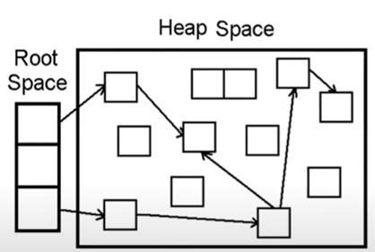
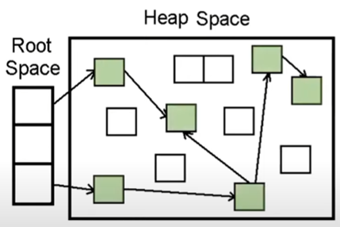
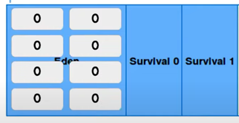

# 🗑 Garbage Collection ( ks0927 )

## GC는 왜 필요한가?

- C/C++은 Heap메모리를 관리하기 위해 프로그래머가 직접 코드에서 할당받고, 해제해야했다.
- 할당받은 메모리 영역을 제대로 해제하지않아 메모리 leak이 발생하기도 했다.
- 자바와 자바 스크립트는 이러한 동적 메모리 영역 해제를 GC가 자동으로  해준다.

다시말하면 GC가 하는일은

> 프로그램이 "**동적으로 할당했던 메모리영역**" 중 "**필요 없게 된 영역**"은  해제한다.

- 동적으로 할당했던 메모리영역 = Heap 영역을 의미
- 필요 없게 된 영역 = 어떤 변수도 가리키지 않는 영역을 의미

GC의 장점
- 메모리 누수(leak) 방지
- 해제된 메모리에 접근 X
- 해제된 메모리를 또 해제하는 이중해제 X

GC의 단점
- GC사용은 순수 오버헤드!
- 개발자는 GC가 언제 메모리를 해제하는지 모른다!

이런 특성에 따라 실시간성이 매우 강조되는 프로그램의 경우 GC에게 메모리 관리를 맡기는 것이 알맞지 않을수 있다.

## GC 알고리즘
그러면 GC는 어떻게 해제할 동적 메모리 영역들을 알아서 판단할까?

대표적 알고리즘 2가지를 소개한다.
1. **Reference Counting**
2. **Mark and Sweep**

### Reference Counting

- Root space는 스택변수, 전역 변수등 heap영역의 참조를 담은 변수들.
- Heap 영역에 선언된 객체들이 각각 reference count라는 별도의 숫자를 가지고있다고 생각하자.
- reference count는 몇가지 방법으로 해당객체에 접근할수있는지 뜻함.
- reference count가 0이되면 접근할 수 있는 방법이 없으니 GC의 대상이 되는 것.

하지만 **순환 참조** 라는 한계가 존재한다.

- Root space에서 Heap space의 접근을 모두끊는다고 가정했을 때 노란색 고리안의 객체들은 서로가 서로를 참조하고있기 때문에 reference count가 1로 유지됨
- 그래서 사용하지않는 메모리 영역이 해제되지 못하고 memory leak발생

### Mark and Sweep

- 루트에서부터 해당 객체에 접근 가능한지를 해제의 기준으로 삼는다.

- 루트에서부터 그래프 순회를 통해 연결된 객체를 찾아내는 **Mark** 과정
- 루트로부터 연결된 객체는 Reachable, 연결되지 않았다면 Unreachable

- 연결이 끊어진 객체를 지우는 **Sweep** 과정

- 객체가 제거되어 파편화된 메모리영역을 앞에서부터 채워나가는 **Compaction** 과정
- 가비지 컬렉터 종류에 따라 하지 않는 경우도 있다.

Mark And Sweep 방법은 순환참조 문제를 해결하였다. 하지만 그럼에도 단점이자 특징이 2가지 존재한다.

1. 의도적으로 GC를 실행시켜야 한다.
2. 어플리케이션 실행과 GC실행이 병행되어야 한다.

정리하면 어느순간에는 실행중인 어플리케이션이 GC에게 컴퓨터 리소스를 내줘야하고 어플리케이션의 사용성을 유지하면서 효율적이게 GC를 실행하는것은 꽤나 어려운 최적화 작업이라는 것이다.

## JVM이란?
JVM의 GC를 알아보기전 JVM의 설명과 자바의 컴파일 과정 알아보자.
- Java 는 OS에 종속적이지 않다는 특징을 가지고 있다. 
- OS에 종속받지 않고 실행되기 위해선 OS 위에서 Java 를 실행시킬 무언가가 필요하다. 그게 바로 JVM이다.

- java 소스코드, 즉 원시코드(*.java)는 CPU가 인식을 하지 못하므로 기계어로 컴파일을 해줘야한다.
- 하지만 Java는 이 JVM 이라는 가상머신을 거쳐서 OS에 도달하기 때문에 OS가 인식할 수 있는 기계어로 바로 컴파일 되는게 아니라 JVM이 인식할 수 있는 Java bytecode(*.class)로 변환된다.
- Java compiler 가 .java 파일을 .class 라는 Java bytecode로 변환한다.
- 여기서 Java compiler는 JDK를 설치하면 bin 에 존재하는 javac.exe를 말한다.
- 변환된 bytecode는 기계어가 아니기 때문에 OS에서 바로 실행되지 않는다.
- 이 때, JVM이 OS가 bytecode를 이해할 수 있도록 해석해준다. 따라서 Byte Code는 JVM 위에서 OS 상관없이 실행될 수 있는 것이다.
- OS에 종속적이지 않고, Java 파일 하나만 만들면 어느 디바이스든 JVM 위에서 실행할 수 있다.

이제 JVM의 구조를 확인해보자.

JVM은 크게 3가지 영역으로 구분된다.
1. 바이트코드를 읽고 클래스 정보를 메모리의 Heap/Method Area에 저장하는 Class Loader
2. 실행중인 프로그램의 정보가 올라가 있는 Memory
3. 바이트 코드를 네이티브 코드로 변환시켜주고 GC를 실행하는 Execution Engine

JVM 실행 엔진이 어떻게 GC를 돌리지는 알기 위해선 JVM 메모리를 조금더 봐야한다.

JVM은 os로부터 메모리를 할당 받은후 해당 메모리를 용도에 따라 여러 영역으로 나누어서 관리한다.

총 5가지영역이지만 크게 2가지로 분류 가능하다.

1. 모든 쓰레드가 공유하는 영역. (Method Area와 Heap)
2. 각 쓰레드마다 고유하게 생성하며 쓰레드 종료시 소멸영역. (stack,pc register,native method stack)

- method area는 프로그램의 클래스 구조를 메타데이터처럼 가지며, 메서드의 코드들을 저장해둔다.
- HEAP은 어플리케이션 실행중에 생성되는 객체 인스턴스를 저장하는 영역. **GC에 의해 관리되는 영역**
- stack은 메서드 호출을 스택 프레임이라는 블록으로 쌓으며 로컬변수, 중간연산 결과들이 저장되는 영역
- pc register는 쓰레드가 현재 실행할 스택 프레임의 주소를 저장하고있다.
- native method stack은 c/c++등의 low level 코드를 실행하는 스택.

- 이전에 말했듯이 자바의 GC는 mark and sweep방식이다.
- JVM GC의 루트 스페이스는 JVM 메모리의 stack의 로컬변수, method area에 저장된 static변수, native method stack의 c/c++로 작성된 JNI 참조이다.

## JVM의 GC방식
- 이전에 말한 mark and sweep 의 특징 첫번째는 **의도적으로 gc를 실행시켜야한다.** 였다.
- JVM GC에겐 “**이때**” 한번 gc 실행시켜야지~ 라는 기준이 있을텐데, “**이때**” 의 타이밍을 알기 위해선 heap 영역을 조금더 들여다 봐야한다.

JVM의 heap영역은 크게 2가지로 나뉜다.
1. Young Generation 
2. Old Generation

- Young Generation에서 발생하는 GC는 minor gc ,Old Generation에서 발생하는 gc는 major gc라고 불린다.
- Young Generation은 3영역으로 다시 나뉘는데 Eden, survival 0, survival1 영역으로 나뉜다.
  - Eden은 새롭게 생성된 객체들이 할당되는 영역
  - survival 영역은 minor gc로부터 살아남은 객체들이 존재하는 영역.
  - survial영역에는 특별한 규칙이 있는데 0 또는 1 영역중 하나는 꼭 비어있어야한다.

실제로 작동되는 모습을 살펴보자.

- Eden에 새로운 객체가 이렇게 생성되다보면 꽉차는순간이 온다.
- 이때 minor gc가 발생한다. Mark and sweep이 진행.

- root로부터 reachable로 판단된 객체는 0영역으로 옮겨짐

- 옮겨지면서 숫자가 0에서 1로 증가되었는데 해당 숫자는 age-bit를 뜻함.
- minor gc에서 살아남을때마다 1씩 증가한다.

- 다시 또 Eden 영역이 가득차면 minor gc가 발생한다.

- 이번엔 root로 부터 reachable로 판단된 객체는 1영역으로 옮겨진다.

- 다시 또 Eden 영역이 가득차면 minor gc가 발생한다.

- 이번엔 root로 부터 reachable로 판단된 객체는 0영역으로 옮겨진다.

- 이렇게 살아남은 객체중 하나가 age-bit가 3이됨.
- JVM GC 에선 일정수준의 age-bit를 넘어가면 오래도록 참조될 객체 라고 판단하여 해당객체를 old generation에 넘겨준다.

- 이과정을 promotion이라고한다.
- 자바 8에서는 parallel gc방식 사용기준 age-bit가 15가 되면 promotion이 진행된다.

- old generation도 다 채워지면 major gc가 발생하면서 mark and sweep 방식을 통해 필요없는 메모리를 비워준다.
- major gc는 minor gc보다 10배 이상의 시간이 사용된다.

예상하고 있는 사람도 있겠지만 왜 heap 영역을 young과 old로 나눈것일까?

GC설계자들이 어플리케이션을 분석해본결과 대부분의 객체가 수명이 짧았다.

GC도 결국 비용이기때문에 메모리의 특정부분만을 탐색하여 해제하면 더 효율적이기 때문이다.

## JVM의 GC 알고리즘 종류

mark and sweep방식의 특징 두번째 "**어플리케이션 실행과 GC실행이 병행된다.**"

앞으로 나열할 JVM의 GC 알고리즘을 보면서 어떻게 어플리케이션 실행과 병행되는지 살펴보기전에 stop the world라는 개념을 먼저 알고가자.

Stop the world란 GC를 실행하기위해 JVM이 어플리케이션 실행을 멈추는 것이다.

앞서 어플리케이션의 사용성을 유지하면서 효율적으로 gc를 실행하는 것이 어려운 최적화 작업이라고 했는데 이 stop the world 시간을 최소화하는 것이 어렵다는 것을 의미한다.

여기서 알아두어야 할 것은 소개할 GC 알고리즘은 모두 설정을 통해 Java에 적용할수 있다는 점이다.

즉, 상황에 따라 필요한 GC 방식을 설정해서 사용할 수 있다.

그럼, 이제부터 다양한 GC 방식을 살펴보기로 하자.

### Serial GC

- Serial gc는 하나의 쓰레드로 GC를 실행하는 방식이다. 
- 하나의 쓰레드로 gc를 실행하다보니 stop the world 시간이 길다.
- 싱글쓰레드 환경 및 heap이 매우 작을 때 사용한다.

### Parallel GC

- Parallel gc는 여러 개의 쓰레드로 gc를 수행한다.
- Serial gc보다 stop the world 시간이 짧아졌다.
- 멀티코어 환경에서 어플리케이션 처리속도를 향상시키기위해 사용된다.
- 자바 8에서 기본으로 쓰이는 gc방식이다.

### CMS GC (Concurrent Mark Sweep)

- Stop the world 시간을 최소화하기위해 고안했다. 
- 대부분의 가비지 수집 작업을 어플리케이션 쓰레드와 동시에 수행해서 stop the world의 시간을 최소화 한다. 
- 메모리와 cpu를 많이 사용한다.
- mark-and-sweep 과정이후 메모리 파편화를 해결하는 compaction이 기본적으로 제공되지 않는다는 단점이있다. 
- 이후 G1 gc의 등장에 따라 deprecated 되었다.

### G1 GC (Garbage First)

- 기존의 GC 알고리즘에서는 Heap 영역을 물리적으로 고정된 Young / Old 영역으로 나누어 사용
- G1 gc는 아예 이러한 개념을 뒤엎는 **Region**이라는 개념을 새로 도입하여 사용.
- 전체 Heap 영역을 **Region**이라는 영역으로 체스같이 분할하여 상황에 따라 Eden, Survivor, Old 등 역할을 고정이 아닌 동적으로 부여
- Garbage로 가득찬 영역을 빠르게 회수하여 빈 공간을 확보하므로, 결국 GC 빈도가 줄어드는 효과를 얻게 되는 원리
- 자바9 이상부터는 G1 GC를 기본 GC 실행방식으로 사용한다.

## 이후 찾아보시면 좋을것들
G1 GC 이후의 Shenandoah GC 와 ZGC (Z Garbage Collector)를 추가적으로 알아보시면 좋을 것 같습니다.

## 참고자료
https://youtu.be/FMUpVA0Vvjw?si=9YRmlDC1oeW3WYGJ

https://doozi0316.tistory.com/entry/1%EC%A3%BC%EC%B0%A8-JVM%EC%9D%80-%EB%AC%B4%EC%97%87%EC%9D%B4%EB%A9%B0-%EC%9E%90%EB%B0%94-%EC%BD%94%EB%93%9C%EB%8A%94-%EC%96%B4%EB%96%BB%EA%B2%8C-%EC%8B%A4%ED%96%89%ED%95%98%EB%8A%94-%EA%B2%83%EC%9D%B8%EA%B0%80

https://inpa.tistory.com/entry/JAVA-%E2%98%95-%EA%B0%80%EB%B9%84%EC%A7%80-%EC%BB%AC%EB%A0%89%EC%85%98GC-%EB%8F%99%EC%9E%91-%EC%9B%90%EB%A6%AC-%EC%95%8C%EA%B3%A0%EB%A6%AC%EC%A6%98-%F0%9F%92%AF-%EC%B4%9D%EC%A0%95%EB%A6%AC#%EA%B0%80%EB%B9%84%EC%A7%80_%EC%BB%AC%EB%A0%89%EC%85%98_%EC%95%8C%EA%B3%A0%EB%A6%AC%EC%A6%98_%EC%A2%85%EB%A5%98